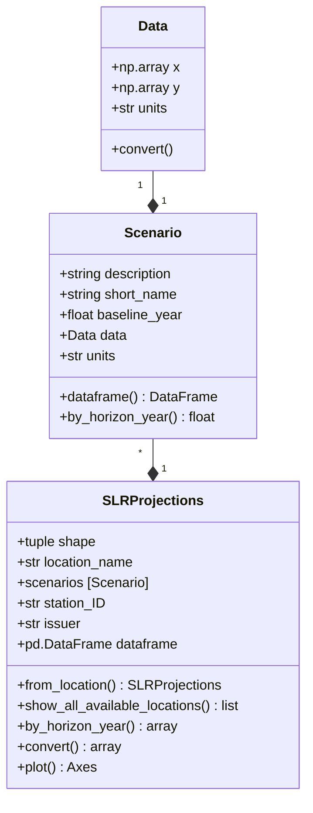

# SLR
SLR is simple package designed to manipulate sea-level projections using the Python language.

## What SLR Does
SLR relies on a single configuration file, named `scenarios.json` to load pre-configured sea-level rise scenarios at specific locations, each wrapped under its own `ScenarioPack` class item. SLR provides convenient classes to perform the following routine tasks:

* Load sea-level rise projections for a specific location
* Display trajectories over time as plots or tables
* Evaluate sea-level rise offset by a certain horizon date
* Compare risk-based sea-level rise trajectories
* Compare historical and future trajectories
* Convert units and modify reference water levels

### Basic Structure
SLR relies on three classes to organize SLR data:

* `SLRProjections` contains a collection of `Scenario` items
* `Scenario` contains `Data` describing a specific SLR trajectory
* `Data` contains the timeline, units, and values for that SLR trajectory

The class hierarchy is illustrated in the Class Diagram, below.



### Extensibility

Custom scenarios can also be built using the `SLRProjections`, `Scenario`, and `Data` class nomenclature. More `SLRProjections` items can be added by modifying and contributing to the `scenarios.json` file.

## Installation
The best way to install the package is to pip install directly from GitHub.com, or cloning the repo on your local machine. Activate your environment and type:

```python
>>> python -m pip install <absolute_cloned_repo_root_directory>
```

An alternative is to temporarily add the path to the `src` folder to PYTHONPATH or invoking the following at the beginning of a `Jupyter` notebook:

```python
>>> sys.path.append(<absolute_cloned_repo_src_directory>)
```

Note in the above that the string appended to the PYTHONPATH should point to the **`src`** path, not the root folder location!

## Quickstart (Jupyter)

SLR provides a very easy way to manipulate sea-level rise scenario datasets. The SLR package was built with convenience in mind and is designed to facilite operations commonly encountered when dealing with sea-level rise projections at specific locations. It is primarily designed to be used within Jupyter and is geared toward practitioners who need to publish their findings in reports.

### Importing SLR
Assuming you installed the package or appended to PYTHONPATH, all that remains to do is to import the package:

```python
>>> import slr
```

### Show All Available Locations
From that point on, we can list all locations available in the `scenarios.json` file: these are as many `ScenarioPack` items:
```python
>>> slr.ScenarioPack.show_all_available_locations(format='list')
```

The locations can be displayed as a `pandas.Dataframe` for further manipulation:
```python
>>> slr.SLRProjections.show_all_available_locations(format='dataframe')
```

### Manipulating SLR Scenarios
Let's load a `ScenarioPack` by invoking a specific location:
```python
>>> sf = slr.ScenarioPack.from_location_or_key(
    location_or_key="San Francisco, CA
)
```

We could do the same using index notation:
```python
>>> sf = slr.ScenarioPack.from_index(index=0)
```

Or we could do the same thing using a key from the `scenarios.json` file:
```python
>>> sf = slr.ScenarioPack.from_key(key="San Francisco")
```

All the SLR projections contained within the `ScenarioPack` can be displayed in iPython and copy/pasted into a report
```python
>>> sf.dataframe
```

### Converting Units
In some cases, units may need to be converted. `SLR` offers on-the-fly capabilities for converting `Data` to any of the allowable units. For example:

```python
>>> sf.convert(to_units='in')
```

The conversion takes place in-place. On-the-fly conversion is not (yet) supported.

### Visualization
We can plot `Scenario` items within a `ScenarioPack` right away: all Scenario items are
plotted automatically by default.

```python
>>> sf.plot()
```

We can also combine commands. In this case, let's convert to feet for easier 
interpretation and let's add a target date to show on the plot.

```python
>>> sf.convert(to_units='ft')
>>> sf.plot(horizon_year=2075)
>>> plt.tight_layout()
```
Here is what this should look like:


By default, all `Scenario` items within a given `ScenarioPack` will be plotted. 
To select specific `Scenario` items see Section **Drilling Into Specific Scenarios** below.

### Calculating Projections by a Certain Date
We can calculate the effective SLR projections by a certain date, e.g.:

```python
sf.by_horizon_year(2075, merge=False)
```

We can also choose to merge that projection into the resultant dataframe, for presentation purposes. Note that the `ScenarioPack` item is not affected by the merging operation, it is only for displaying purposes.

```python
sf.by_horizon_year(horizon_year=2075, merge=True)
```

### Drilling Into Specific Scenarios
Each `ScenarioPack` item contains one or more `Scenario` items which can be conveniently retrieved using index notation:

```python
sf_scenario = sf[1]
sf_scenario
```

And here is what it should look like:

```
Scenario 'Medium Risk', values are given in in and years range from 2030 to 2100
```

This allows to "drill down" into the scenarios. Let's return to our prior example of visualization, and let's manipulate a specific scenario:

```python
# Display a base figure using the builtin method
ax = sf.plot(horizon_year=2075)
# Highlight the specific Scenario item retained for design
ax.plot(sf_scenario.data.x, sf_scenario.data.y, c='yellow', label='Selected for design', lw=10, alpha=.65)
# Use the builtin class method to estimate SLR by the horizon year
ax.axhline(y=sf_scenario.by_horizon_year(horizon_year=2075), c='k', ls='--', lw=1)
# Update the legend
plt.legend()
plt.tight_layout()
```

Here is what this should now look like:


### Comparing with the Historical Rate **New**
You can attempt to retrieve the historical sea-level rise from NOAA servers. To do that, simply create a new `HistoricalSLR` instance:

```python
>>> HistoricalSLR.from_station(id=<your_NOAA_station_ID>)
```

## Customizing the `scenarios.json` File

SLR works by loading a JSON file located under `.\data\scenarios.json`. The format of the file mimics the structure of `ScenarioPack`, `Scenario`, and `Data` class items. An example is shown for San Francisco, CA. The data was extracted from the 2018 State of California Sea-level Rise Guidance document published by the Ocean Council. SLR is built upon that publication but can be used to handle other guidelines, as long as the same nomenclature is used.

### Basic Structure
The structure of the JSON file mimics the classes used in SLR. An extract of the file is shown below:

```json
{
    "San Francisco": {
        "description": "San Francisco, CA",
        "station ID (CO-OPS)": "9414290",
        "scenarios": [
            {
                "description": "High Emission, Low Risk (Likely Range)",
                "short name": "Low Risk",
                "units": "ft",
                "probability (CDF)": 0.83,
                "baseline year": 2000,
                "data": {
                    "x": [
                        2030,
                        2040,
                        2050,
                        2060,
                        2070,
                        2080,
                        2090,
                        2100
                    ],
                    "y": [
                        0.5,
                        0.8,
                        1.1,
                        1.5,
                        1.9,
                        2.4,
                        2.9,
                        3.4
                    ]
                }
            },
            {
                "description": "High Emission, Medium-High Risk (1-in-200 Chance)",
                "short name": "Medium Risk",
                "units": "ft",
                "probability (CDF)": 0.995,
                "baseline year": 2000,
                "data": {
                    "x": [
                        2030,
                        2040,
                        2050,
                        2060,
                        2070,
                        2080,
                        2090,
                        2100
                    ],
                    "y": [
                        0.8,
                        1.3,
                        1.9,
                        2.6,
                        3.5,
                        4.5,
                        5.6,
                        6.9
                    ]
                }
            },
            {
                "description": "High Emission, Extreme Risk (H++ Scenario)",
                "short name": "Extreme Risk",
                "units": "ft",
                "probability (CDF)": null,
                "baseline year": 2000,
                "data": {
                    "x": [
                        2030,
                        2040,
                        2050,
                        2060,
                        2070,
                        2080,
                        2090,
                        2100
                    ],
                    "y": [
                        1.0,
                        1.8,
                        2.7,
                        3.9,
                        5.2,
                        6.6,
                        8.3,
                        10.2
                    ]
                }
            }
        ]
    }
}
```

### Adding New Locations and Projections

New locations can be added using the same nomenclature. Currently, the following fields are implemented:

* "ID": a unique key for each `ScenarioPack` item
  - "location name": the location for these SLR scenarios, e.g., "San Francisco, CA"; a unique location defines a given `ScenarioPack`
  - "station ID (CO-OPS)": the NOAA or CO-OPS identification string for the location, if available, e.g, "9414290", a unique location defines a given `ScenarioPack`
  - "scenarios": an array of JSON items containing specific `Scenario` items

Each `Scenario` item consists of the following:

* description: describes the `Scenario`, e.g. "Extreme High"
* short name: a short description of the Scenario, used in plots for example
* units: can only be one of the allowable values (see below section)
* probability: a number specifying the probability (CDF) of the `Scenario`, 0 to 1.
* baseline year: the value for the baseline year for the `Scenario`
* data: dict, a dictionary representing the `Data` item, itself comprising two elements:
    - "x" : an array containing the years where projections are provided
    - "y" : an array containing the values for sea-level rise at these years, in the units referenced above

### Allowable Units

Supported units are limited to the following:

* 'ft' : feet (US)
* 'm' : meters
* 'cm' : centimeters
* 'in' : inches
